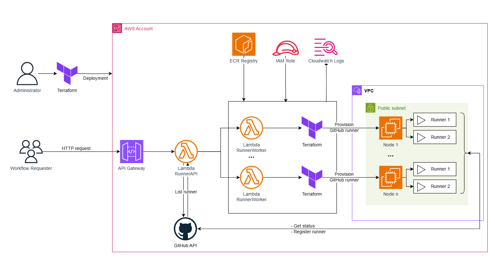

# Provision self-hosted GitHub runners on-demand in AWS


## Purpose
This project aims to provision self-hosted GitHub runners on-demand in AWS. It automates the setup and scaling of GitHub runners to handle CI/CD workloads efficiently.

## Features
- Scaling & Sustainability: Automatically calculating runners, scale up and down based on requesting.
- Life cycles: Self-killed when no jobs are running after particularly time.
- Security: Runners are created on-demand and terminated after use (ephemeral runners).
- Cost optimization: Runners are created on AWS spot instances.
- Runner level: Support organization and repository level runners. Enterprise level runners are not supported (yet).
- Multi-Runner: Create multiple runner configurations with a single deployment

## Architecture
The architecture of this project is illustrated below:



## Scope
The scope of this project includes:
- Provisioning AWS resources required for GitHub runners.
- Configuring GitHub runners to scale based on demand.
- Ensuring secure and efficient communication between GitHub and AWS.

## Requirements
- AWS Account with appropriate permissions.
- GitHub account with repository access or organization access.
- Terraform v1.0 or later.
- AWS CLI configured with appropriate credentials.
- Docker installed on the local machine.

## Usage
Once the setup is complete, the GitHub runners will automatically scale based on the CI/CD workload. You can monitor and manage the runners through the AWS Management Console and GitHub repository settings.

## Log
You can view logs through AWS CloudWatch - Log Groups:
```
/aws/lambda/autorunner
/aws/lambda/autorunnerworker
```

## Contributing
Contributions are welcome! Please see the `CONTRIBUTING.md` file for guidelines on how to contribute to this project.

## License
This project is licensed under the MIT License. See the LICENSE file for more details.
```